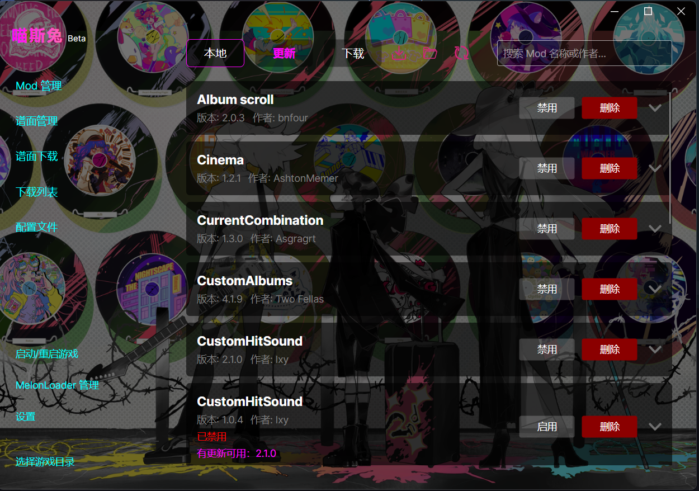
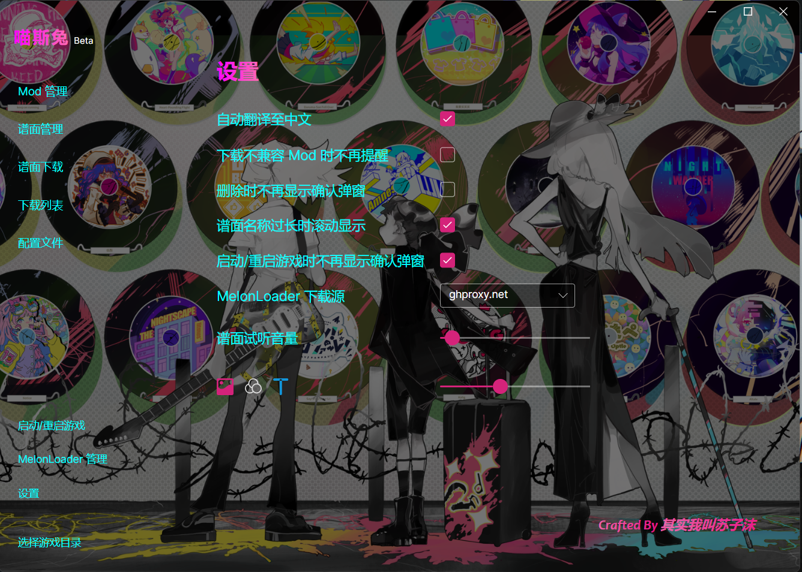

# MuseDashTOOL

一个为《喵斯快跑》(Muse Dash) 设计的现代、功能强大且易于使用的模组管理工具。基于 AvaloniaUI 构建，目前为 Windows 用户提供流畅的操作体验。

设计参考了 MuseDashModTool 有许多相近的功能

##  功能

-   **文件管理**：多维度管理模组以及自制谱面
-   **配置管理**：支持直观地修改模组配置文件
-   **曲谱下载**：能够快速下载mdmc社区的谱面，支持软件内试听
-   **自定义主题**：背景自定义，触发某些操作之后可以进入隐藏模式，支持自定义主题
-   **自动翻译**：自动翻译模组描述
-  （总之能够使你能够方便的管理任何和喵斯快跑有关的东西）

### 准备工作

-   Steam版本喵斯快跑

## 屏幕截图

*(在此处添加你的应用截图)*

